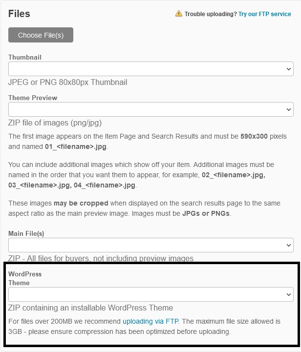

# Troubleshooting
[[toc]]

## Additional Envato accounts aren't authenticating
Envato's authentication flow doesn't ask which account you want to use. If you attempt to authenticate against Envato and are already logged into any Envato marketplace, Envato will attempt to authenticate against that account. If that account has authenticated with Package Peak already, it'll simply direct you back to your dashboard.

To set up multiple Envato accounts with Package Peak, we recommend using a private browser window to add additional accounts. This will ensure you aren't already logged into any Envato accounts and let you log into the specific Envato account you want to use.

## Some of my purchases aren't appearing
Sometimes a theme or plugin author may not include the installable ZIP file when publishing their plugin or theme. This currently prevents Package Peak from knowing exactly what kind of package this is. Please contact the theme or plugin author and direct their attention to the following field when uploading their plugin or theme to ThemeForest or CodeCanyon:



In the future, we may include a way for you to manually declare purchases as themes or plugins.

## My plugin/theme installs into the wrong directory
Sometimes, a theme or plugin may hard-code paths to its files. In this case, if the assumed directory name doesn't match the slug-ified version of the package's name on ThemeForest or CodeCanyon, the plugin or theme may throw fatal errors when processing includes based on those paths.

This is bad practice, and authors should be using WordPress core functions like `plugin_dir_path( __FILE__ )` to get these paths. But authors may be slow to fix this, or unwilling to fix it at all.

This can be best explained with an example. Let's assume we have a plugin that:
- Is listed on CodeCanyon as **"The Cool Events Plugin"**
- Installs to `plugins/cool-events` when installed via the WordPress admin
- Includes the following code: `require_once( WP_CONTENT_DIR . 'plugins/cool-events/includes/helpers.php' )`

When using Composer and Package Peak, this plugin will be installed to `plugins/the-cool-events-plugin`. This will cause a fatal file not found error on the line above.

For a quick fix, you can utilize Composer's `installer-paths` feature to manually adjust the install directory for this package. Given the above example, you would add the following to your `composer.json` file:

```
"extra": {
    "installer-paths": {
      "web/wp-content/plugins/cool-events": [
        "author/the-cool-events-plugin"
      ],
      ... // Leave the other Bedrock installer paths here.
    }
	...
}
```

## Support
If you're having additional trouble with Package Peak, please [contact us](mailto:ethan@sternerstuff.dev).